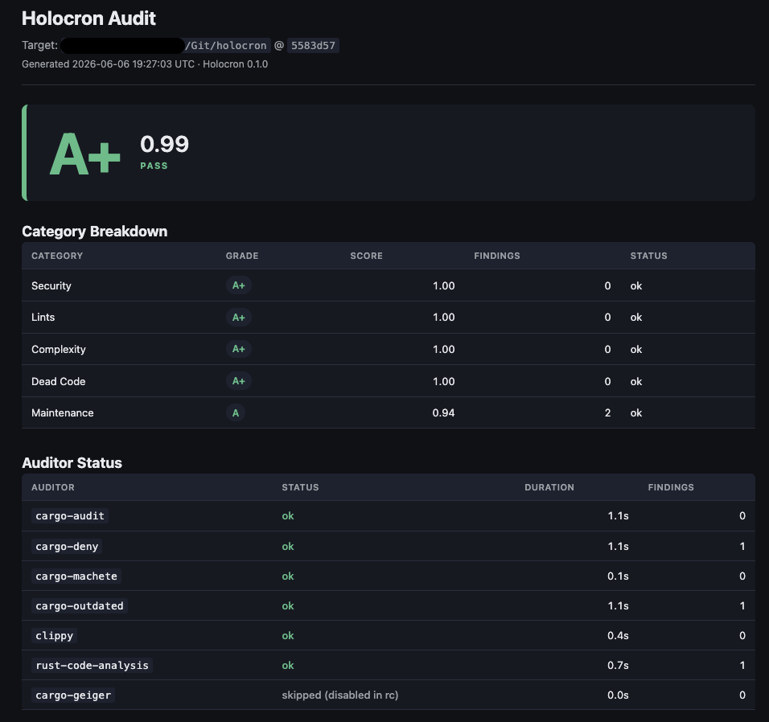

# Holocron

> *"A Jedi holocron is a repository of wisdom — open it and the truth of your codebase is revealed."*

<p align="center">
  
</p>

<p align="center"><em>Holocron grading itself. All your Rust audits, one report card.</em></p>

**Holocron** is a Rust codebase auditor. It runs eight analyzers in parallel against your project (clippy, cargo-audit, cargo-machete, cargo-deny, cargo-outdated, cargo-geiger, rust-code-analysis, plus opt-in cargo-mutants) and emits a single graded report card you can hand to an LLM, gate a CI build on, share with a non-engineer, or paste into a code review.

## Status

🟢 **v0.2 shipping.** Eight auditors (seven default + one opt-in), four subcommands (`audit`, `diff`, `init`, `explain`), four output formats (Markdown + JSON + SARIF v2.1.0 + HTML), full `.holocronrc.toml` support (gate, complexity, auditors, weights, allowlist), inline `// holocron: ignore` annotations, live progress display, silent-failure guard on every shell-out auditor, and a CI dogfood gate. See the [issue tracker](https://github.com/abudhu/holocron/issues) for what's next.

Holocron eats its own dogfood — every push runs `holocron audit .` and gates the build on the grade. Current self-grade: **A+ (0.99)** with one finding suppressed via an inline annotation as intentional design.

## Quick start

```bash
# Install Holocron from source (not on crates.io yet)
git clone https://github.com/abudhu/holocron
cd holocron
cargo install --path crates/holocron-cli --locked

# Install the auditor binaries Holocron drives (one-time)
# Fast path: cargo-binstall pulls precompiled GitHub release artefacts (~1 min)
cargo install cargo-binstall --locked
cargo binstall --no-confirm cargo-audit cargo-machete cargo-deny cargo-outdated cargo-geiger
cargo install --git https://github.com/mozilla/rust-code-analysis rust-code-analysis-cli --locked
rustup component add clippy

# Slow path: from-source compiles (~5 min) — equivalent result
# cargo install cargo-audit cargo-machete cargo-deny cargo-outdated cargo-geiger --locked

# Audit a project
holocron audit ~/Git/my-rust-project
```

You get a live progress display on stderr while auditors run, a grade card on stdout when they finish, a Markdown report at `<project>/.holocron/reports/<ts>.md`, and a JSON sidecar at the same path with `.json`. Reports live inside the project (not `/tmp`) so they travel with the code under review and survive reboots / tmpwatch.

Want more? `--html` gives you a self-contained dark-themed HTML page for sharing. `--sarif` gives you GitHub Code Scanning-ready output.

Add `.holocron/` to your `.gitignore` — the tool recreates the directory on demand and you don't want timestamped audit artefacts in version control.

## What gets graded

Five categories × eight auditors (seven default + one opt-in):

| Category    | Auditor(s)                                       | What it surfaces                                            |
| :---------- | :----------------------------------------------- | :---------------------------------------------------------- |
| Security    | cargo-audit, cargo-geiger                        | RUSTSEC advisories, `unsafe` surface in your dep tree       |
| Lints       | clippy                                           | Style, correctness, performance lints (default + pedantic)  |
| Complexity  | rust-code-analysis, cargo-mutants¹               | Cyclomatic + cognitive complexity, missed-mutant test gaps  |
| Dead Code   | cargo-machete                                    | Unused dependencies in your Cargo.toml                      |
| Maintenance | cargo-deny, cargo-outdated                       | License/banned-crate policy violations, outdated deps       |

¹ cargo-mutants is opt-in via `--with-mutants`. It's slow (30 min – several hours on real workspaces), so the default set leaves it out.

Each finding has a severity (Info, Low, Medium, High, Critical). The category score is `1.0 - sum(severity_weights)` clamped to `[0, 1]`. Overall grade is a weighted average across categories (defaults: Security 0.30, Lints 0.20, Complexity 0.20, Dead Code 0.15, Maintenance 0.15 — all five are overridable via `[weights]` in rc).

**Silent-failure guard.** Every auditor that shells out to an external tool is wrapped in a completeness check: if the tool exits non-zero, produces no parseable findings, AND wrote to stderr, the auditor returns `Failed` (not `Ok([])`). The category gets marked Skipped instead of being silently graded A+ on a broken tool. Without this, an offline cargo-audit advisory DB or a cargo-deny crash would inflate the grade.

## Subcommands

### `holocron audit <path>`

The main act. Walks `<path>` until it finds a `Cargo.toml`, runs all enabled auditors in parallel, writes the report.

```bash
# Plain audit, default outputs
holocron audit .

# Add HTML + SARIF + CI gate
holocron audit . --html --sarif --fail-below A-

# Opt into mutation testing (slow — 30 min+)
holocron audit . --with-mutants

# Quiet progress for CI logs
holocron audit . --progress log --fail-below B
```

Useful flags:

| Flag                    | Effect                                                                                |
| :---------------------- | :------------------------------------------------------------------------------------ |
| `--output <file>`       | Override the default `<project>/.holocron/reports/<ts>.md` location                   |
| `--no-json`             | Skip the JSON sidecar                                                                 |
| `--sarif`               | Also emit a SARIF v2.1.0 sidecar for GitHub Code Scanning / Azure DevOps              |
| `--html`                | Also emit a self-contained HTML report (dark theme, no JS, no external assets)        |
| `--fail-below <GRADE>`  | CI gate: exit 1 if the overall grade is below this letter (`A+`, `A`, `A-`, …, `F`)   |
| `--install-missing`     | Auto-install missing auditor binaries (otherwise they surface as Skipped)             |
| `--with-mutants`        | Add cargo-mutants to the audit set. Test-quality signal; expect 30 min – many hours   |
| `--progress <mode>`     | `auto` (default), `tty` (spinner block), `log` (timestamped events), `off`            |
| `--timeout <secs>`      | Per-auditor timeout, default 600                                                      |

Exit codes:

- `0` — clean, or gate passed AND no categories were skipped
- `1` — `--fail-below` gate failed (quality regression)
- `2` — invalid args, broken config, or unparseable rc file (fast-fail)
- `3` — auditor outage (one or more categories couldn't be measured); overall grade is advisory

### `holocron diff <base-ref> <path>`

Audit a project but score only the findings touching files changed since `<base-ref>`. Useful for pre-commit hooks, PR review fast-paths, and "what did this branch break."

```bash
# Vs the main branch tip
holocron diff main .

# Vs N commits ago
holocron diff HEAD~5 .

# PR-style diff vs origin/main, with a CI gate
holocron diff origin/main . --fail-below A-
```

Runs the full audit then post-filters: findings whose file isn't in the changed set are dropped, project-wide findings (cargo-audit advisories with no file pin) are dropped, then the grade is recomputed on what's left. A banner reports the kept/dropped counts so you know what wasn't examined:

```
Diff filter: 6 changed files → kept 3 findings, dropped 18 out-of-scope, dropped 2 project-wide
  (project-wide findings like cargo-audit advisories aren't tied to a specific file; run `holocron audit` for those)
```

Bogus refs get a clear error (`git ref 'foo' not found in /path. Try a SHA, branch, or HEAD~N.`). Working tree with zero changes since the ref exits clean with a friendly message.

### `holocron init [<dir>]`

Drops a heavily-commented `.holocronrc.toml` template into the target dir (default: current dir). Every supported section is documented inline.

```bash
cd my-project
holocron init
git add .holocronrc.toml
```

Pass `--force` to overwrite an existing rc file.

### `holocron explain <fingerprint>`

Looks up a single finding by 16-char hex fingerprint and prints an LLM-friendly Markdown block ready to paste into Cortana / Codex / Claude Code:

```bash
# Auto-discovers the most recent <target>/.holocron/reports/*.json
# (--target defaults to .; walks up looking for Cargo.toml like `audit`)
holocron explain a1b2c3d4e5f60718

# Or specify the sidecar explicitly
holocron explain a1b2c3d4e5f60718 --from .holocron/reports/1780773920.json

# Or scan a different project's reports
holocron explain a1b2c3d4e5f60718 --target ~/Git/some-other-project

# Pipe straight into an agent
holocron explain a1b2c3d4e5f60718 | pbcopy
```

Output is a 3-section Markdown block: finding metadata, full diagnostic, and a prompt template asking the LLM to read the file, explain the lint, propose the diff, and call out trade-offs.

## Suppressing findings

Two channels — pick whichever fits the situation:

### Inline `// holocron: ignore <code>` annotations (preferred for code-local issues)

Drop a comment immediately above the offending line (or trailing on the same line) and the finding is suppressed:

```rust
// holocron: ignore clippy::unwrap_used -- test data, panic is acceptable
let value = config.unwrap();

// trailing form works too:
let n = compute().unwrap();   // holocron: ignore clippy::unwrap_used -- ok
```

Format: `// holocron: ignore <code> -- <reason>`. The `-- <reason>` is optional but surfaces in the report's "Allowlisted Findings" section for posterity.

Works for any finding that has a `file:line` location and a `code` field. Comment prefixes accepted: `//` (Rust/JS/C-style) and `#` (TOML/YAML/Python — useful when the auditor scans non-Rust files in your tree).

### `.holocronrc.toml` `[[allowlist]]` entries (preferred for project-wide / no-location findings)

For findings without a source location (cargo-audit advisories pin to a Cargo.lock entry, not a file line) or when you want a project-wide rule, use rc:

```toml
[[allowlist]]
auditor = "cargo-audit"
code    = "RUSTSEC-2024-0001"
reason  = "transitive via tokio; upstream PR open; tracked in issue #99"
```

Match fields are AND-ed: `fingerprint`, `auditor`, `code`, `message_prefix`, `path` (substring). At least one must be set. See the rc template (`holocron init`) for the full schema and examples.

**Precedence:** rc rules fire first, then inline annotations. First-match-wins on overlap — won't double-process.

## CI integration

### GitHub Actions

Full pipeline — installs auditor binaries via `cargo-binstall`, runs the audit, gates the build, and uploads SARIF to Code Scanning:

```yaml
name: holocron
on: [push, pull_request]
jobs:
  audit:
    runs-on: ubuntu-latest
    steps:
      - uses: actions/checkout@v4
      - uses: dtolnay/rust-toolchain@stable
        with: { components: clippy }
      - uses: cargo-bins/cargo-binstall@main
      - run: cargo binstall --no-confirm cargo-audit cargo-machete cargo-deny cargo-outdated cargo-geiger
      - run: cargo install --git https://github.com/mozilla/rust-code-analysis rust-code-analysis-cli --locked
      - run: cargo install --git https://github.com/abudhu/holocron holocron-cli --locked
      - run: holocron audit . --sarif --fail-below A-
      - uses: github/codeql-action/upload-sarif@v3
        if: always()
        with:
          sarif_file: ./.holocron/reports/
```

### Generic CI (any shell-capable runner)

```bash
# In a Rust 1.96+ container with rustup + cargo available
set -euxo pipefail
cargo --version
rustup component add clippy 2>/dev/null || true
# --progress log keeps CI output deterministic + parseable.
# --fail-below A- gates the build at A− or better.
holocron audit . --progress log --fail-below A-
```

**Cold-cache install speedup**: prefer `cargo binstall` over `cargo install` for the auditor binaries — precompiled GitHub release artefacts vs from-source compiles. Install step drops from ~5 min to ~1 min on a cold cache.

### Pre-commit hook with `diff` mode

```bash
#!/usr/bin/env bash
# .git/hooks/pre-commit — gate the diff against the last commit
exec holocron diff HEAD~1 . --fail-below A-
```

## Configuration: `.holocronrc.toml`

Cargo-style walk-up: Holocron looks for `.holocronrc.toml` in the target dir, then ancestors. Generate the template with `holocron init`. Every section below is wired and active.

```toml
# [gate] — CI default for --fail-below when the flag is omitted.
# Explicit --fail-below on the command line wins.
[gate]
fail_below = "A-"

# [complexity] — override the rust-code-analysis severity ladder.
# Missing keys keep the built-in defaults (cyc 15/25, cog 20/35).
[complexity]
cyclomatic_medium = 15
cyclomatic_high   = 25
cognitive_medium  = 20
cognitive_high    = 35

# [auditors] — opt out of specific auditors. Opt-out semantic: missing
# key = enabled, explicit true = enabled, explicit false = disabled.
# Disabling all auditors in a category marks that category as Skipped
# (advisory grade, exit code 3). Disabling one auditor in a multi-auditor
# category (e.g. cargo-deny in Maintenance) leaves the category graded
# by the remaining auditor (cargo-outdated in this case).
[auditors]
clippy             = true
cargo-audit        = true
cargo-machete      = true
cargo-deny         = true
cargo-outdated     = true
cargo-geiger       = true
rust-code-analysis = true
# cargo-mutants is opt-in via --with-mutants; set false here as a
# kill switch even when the flag is passed.
cargo-mutants      = false

# [weights] — override per-category weights in the overall grade.
# Default sums to 1.0; if your overrides don't sum to 1.0 the grader
# renormalizes and emits a stderr warning.
[weights]
security    = 0.30
lints       = 0.20
complexity  = 0.20
dead_code   = 0.15
maintenance = 0.15

# [[allowlist]] — suppress specific findings from the grade math.
# Allowlisted findings still appear in the report's "Allowlisted
# Findings" section with the reason; they're excluded from category
# scores. Match by AND across set fields: fingerprint, auditor, code,
# message_prefix, path (substring against the file path). At least
# one field must be set (an empty entry is rejected at load).
#
# For findings with a source location, prefer the inline
# `// holocron: ignore <code> -- <reason>` annotation form instead —
# it lives next to the code and doesn't require a fingerprint lookup.
[[allowlist]]
auditor = "cargo-audit"
code    = "RUSTSEC-2024-0001"
reason  = "transitive via tokio; upstream PR open; tracked in issue #99"
```

Unknown keys at any level are rejected with a line-numbered error and the list of valid options. Typo `cargo-geigr` shows you `cargo-geiger` in the error message immediately.

## Why this tool exists

- **Fallow** does this beautifully for TypeScript/JavaScript. The Rust ecosystem has the pieces — they're just not unified.
- A single graded report is more LLM-portable than eight different tool outputs. `holocron explain <fp> | pbcopy` and paste it into any coding agent.
- HTML output means audit results are shareable with PMs and security teams who don't want to read markdown in a terminal.
- Holocron grades itself on every push. The same gate that protects your project protects this one.

## Architecture

```
crates/
  holocron-core/       Auditor trait, Runner, Finding model, Grade math, Config schema,
                       allowlist matcher, inline-annotation parser, AuditorEvent progress channel.
  holocron-auditors/   One module per CLI tool wrapper: clippy, deny, geiger, machete,
                       mutants, outdated, rust_code_analysis, rustsec — plus a shared
                       `runners` module with the silent-failure-guard helper.
  holocron-report/     Markdown, JSON, SARIF, and HTML renderers.
  holocron-cli/        Wires it together: audit / diff / init / explain subcommands, --with-mutants,
                       --html / --sarif output, --progress display, rc merge, inline-annotation pass.
```

All four crates lint at `clippy::pedantic + clippy::nursery + -D warnings`. Test suite: 170 passing.

## License

MIT — see [LICENSE](./LICENSE).

## Contributing

See [CONTRIBUTING.md](./CONTRIBUTING.md) for the workflow + style
expectations. Security issues: see [SECURITY.md](./SECURITY.md). All
participation is governed by the [Code of Conduct](./CODE_OF_CONDUCT.md).

## Author

Amit Budhu — [github.com/abudhu](https://github.com/abudhu)
